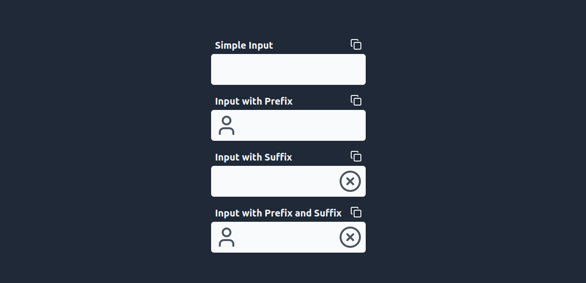
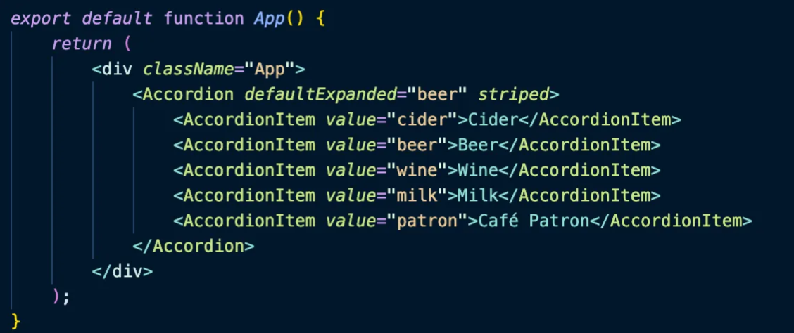

## Composition Pattern

[](https://vitejs.dev/guide/)
[](https://tailwindcss.com/)

### summary

- [About](#about-the-project)
- [Input preview](#input-preview)
- [Accordion code example](#accordion-code-example)
- [Install dependencies](#install-dependencies)
- [Run project](#run-project)
- [Code examples](#code-examples)
 
---

### About the project:
The **Composition Pattern** is a way of building components in React (or other frameworks) by combining smaller, reusable pieces. Instead of having a giant "parent" component, you create functionality by assembling smaller components like Lego blocks. This approach makes the code more flexible and easier to maintain because you can mix and match the blocks as needed.

### Input preview


### Accordion code example


### Install dependencies
```bash
npm install
```

### Run project
```bash
npm run dev
```

### Code examples

#### Simple Input
```tsx
import { Field } from "./components";

export function App() {
  return (
    <Field.Root tabIndex={1} className="w-80 h-16 mx-auto">
      <Field.Input />
    </Field.Root>
  )
}
```

#### Input with Prefix
```tsx
import { User } from "lucide-react";

import { Field } from "./components";

export function App() {
  return (
    <Field.Root tabIndex={1} className="w-80 h-16 mx-auto">
      <Field.Prefix className="hover:cursor-pointer">
        <User className="text-gray-600" size={48} />
      </Field.Prefix>

      <Field.Input />
    </Field.Root>
  )
}
```

#### Input with Suffix
```tsx
import { CircleX } from "lucide-react";

import { Field } from "./components";

export function App() {
  return (
    <Field.Root tabIndex={1} className="w-80 h-16 mx-auto">
      <Field.Input />

      <Field.Suffix className="hover:cursor-pointer">
        <CircleX className="text-gray-600" size={48} />
      </Field.Suffix>
    </Field.Root>
  )
}
```

#### Input with Prefix and Suffix
```tsx
import { CircleX, User } from "lucide-react";

import { Field } from "./components";

export function App() {
  return (
    <Field.Root tabIndex={1} className="w-80 h-16 mx-auto">
      <Field.Prefix className="hover:cursor-pointer">
        <User className="text-gray-600" size={48} />
      </Field.Prefix>

      <Field.Input />

      <Field.Suffix className="hover:cursor-pointer">
        <CircleX className="text-gray-600" size={48} />
      </Field.Suffix>
    </Field.Root>
  )
}
```
